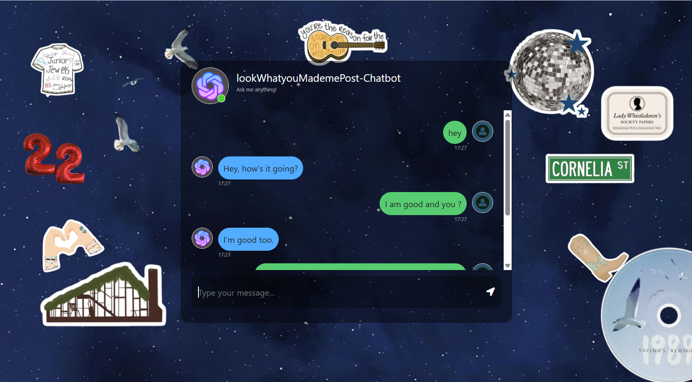

# 📊Chatbot-SubtitleGenerator
Hey everyone! I've been working and studying more about NLP, and to delve deeper into the subject, I decided to develop a chatbot that helps you create captions for your photos based on Taylor Swift songs. The main idea is to upload a photo, and the chat will analyze which caption matches the aesthetic of your photo.

## 📎Technologies used
- 

## ⚙️ Features:
- 

## 🖼️ Chatbot Preview:



## 🔗 Visualização Online (opcional):

## Installation & Setup

Ensure pip is installed by running the following command

```
pip --version
```

If you have Python & pip installed then check their version in the terminal or command line tools

```
python3 --version
```

```
pip --version
```

## Installing Flask

In your terminal run the requirements.txt file using this pip

```
pip install -r requirements.txt
```

## Running ChatBot Application in Terminal

```
cd into your directory
```

```
python3 app.py
```


**This project was developed for learning and professional development purposes**
